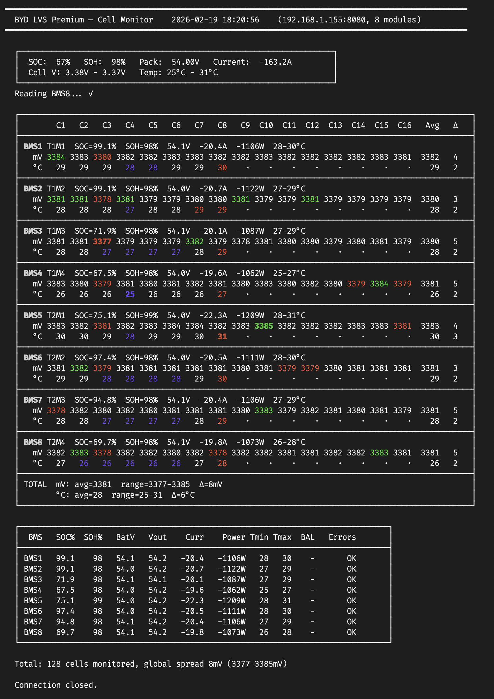

# BYD Battery-Box Cell Monitor

Cell-level monitoring for BYD Battery-Box Premium LVS (and HVS/HVM) systems via Modbus RTU over TCP.

Reads individual cell voltages, temperatures, SOC/SOH, balancing status and error flags from all BMS modules — the same data visible in the BYD BE Connect Plus service application.



## Features

- **Cell voltages** per module (16 LFP cells) with color-coded outlier detection
  - Cyan = lowest cell (≥5 mV below second lowest)
  - Red = highest cell (≥5 mV above second highest)
  - Orange = cell currently being balanced
- **Temperature sensors** (8 per module) with outlier coloring
  - Light blue = coldest sensor (≥2°C below second coldest)
  - Red = hottest sensor (≥2°C above second hottest)
- **Per-module overview**: SOC, SOH, voltage, current, power, temperature range
- **Energy tracking**: lifetime kWh charged/discharged, round-trip efficiency (η)
- **Cycle counting** based on discharge energy and usable module capacity
- **Warranty remaining** percentage based on BYD LVS warranty throughput tables
- **BMU and module serial numbers** read from Modbus registers
- **Auto-detection** of module count from BMU configuration register
- **Multi-tower support** with separate tables per tower
- **Disclaimer prompt** with `--yes` bypass for scripted usage
- **No cloud, no account** — direct LAN connection to your battery

## Requirements

- Python 3.8+
- [pymodbus](https://pypi.org/project/pymodbus/) ≥3.5
- BYD Battery-Box connected via Ethernet (LAN cable to BMU)
- No other application connected to the battery (BE Connect, Node-RED, etc.)

## Quick Start

```bash
git clone https://github.com/oliveres/byd-lvs-monitor.git
cd byd-lvs-monitor
pip install -r requirements.txt

# Run with default IP (192.168.16.254)
python3 byd_lvs_monitor.py

# Custom BMU IP address
python3 byd_lvs_monitor.py --host 192.168.1.155

# Two towers (8 modules), skip disclaimer
python3 byd_lvs_monitor.py --host 192.168.1.155 --towers 2 --yes
```

## Usage

```
usage: byd_lvs_monitor.py [-h] [--host HOST] [--port PORT] [--modules MODULES]
                           [--towers TOWERS] [--yes]

BYD Battery-Box LVS/HVS/HVM cell-level monitor

options:
  -h, --help         show this help message and exit
  --host HOST        BMU IP address (default: 192.168.16.254)
  --port PORT        BMU TCP port (default: 8080)
  --modules MODULES  number of BMS modules, 0=auto-detect (default: 0)
  --towers TOWERS    number of towers for display grouping (default: 1)
  --yes, -y          accept disclaimer without prompting
```

| Argument | Description |
|----------|-------------|
| `--host` | BMU IP address. Default `192.168.16.254` (factory). Use your DHCP-assigned IP if different. |
| `--port` | Modbus TCP port. Default `8080`. |
| `--modules` | Override auto-detected module count. `0` = auto-detect from BMU. |
| `--towers` | Number of battery towers. Controls table grouping (e.g. `--towers 2` for 8 modules = 4 per tower). |
| `--yes` / `-y` | Skip the disclaimer confirmation prompt. Useful for cron jobs or scripts. |

## How It Works

The BYD BMU exposes a Modbus RTU interface over TCP (port 8080). Cell-level data
is not available through standard register reads — it requires a three-step protocol:

1. **Write** `[bms_id, 0x8100]` to register `0x0550` (request data from module)
2. **Poll** register `0x0551` until it returns `0x8801` (data ready, ~2 seconds)
3. **Read** 65 registers from `0x0558` four times (FIFO buffer, 260 registers total)

The response contains cell voltages (16 × mV), temperatures (8 × °C), SOC, SOH,
current, balancing flags, lifetime energy counters, serial number, warnings and errors.

For full protocol details see [MODBUS.md](MODBUS.md).

## Network Setup

The BMU default IP is `192.168.16.254`. If your home network uses a different subnet,
you have two options:

**Option A — Static route** (recommended, no changes to battery):
```bash
# Linux
sudo ip route add 192.168.16.254/32 dev eth0

# macOS
sudo route add 192.168.16.254 -interface en0
```

**Option B — DHCP**: Newer firmware versions support DHCP. Check your router's
DHCP leases for the BMU's assigned address. You can verify connectivity by opening
`http://<BMU_IP>` in a browser — you should see a login page.

## Tested Hardware

| System | Modules | Cells | Status |
|--------|---------|-------|--------|
| BYD LVS Premium 32 kWh (2 towers × 4 modules) | 8 | 128 | Verified |

The protocol should also work with HVS and HVM systems (same BMU firmware),
but cell count and temperature layout may differ. Contributions welcome!

## Compatibility

- **pymodbus 3.5+**: Automatic framer import detection (supports 3.5 through 3.12+)
- **Python 3.8+**: No external dependencies beyond pymodbus
- **Tested on**: Raspberry Pi OS (arm64), Ubuntu 24.04, macOS

## Limitations

- Only **one Modbus client** can connect at a time. Close BE Connect Plus before running.
- Full scan of 8 modules takes **~20 seconds**. Not suitable for sub-second monitoring.
- The script performs **read-only** operations. It cannot change battery configuration.
- WiFi connection to BMU times out after a few minutes. Use **LAN cable** for reliable access.

## Disclaimer

The software displays this disclaimer on startup that must be accepted before proceeding.
Use `--yes` to bypass the prompt for non-interactive use.

> **DISCLAIMER**
>
> This software is NOT an official BYD diagnostic tool.
> It is provided "AS IS" without warranty of any kind.
>
> By using this software, you acknowledge and agree that:
> - The author assumes NO liability for any damages whatsoever
> - You waive all claims for compensation arising from its use
> - You accept full responsibility for any decisions made based
>   on information provided by this software
> - Incorrect readings may occur due to communication errors
>   or firmware differences
>
> BYD and Battery-Box are registered trademarks of BYD Company Limited.

## Related Projects

| Project | Description |
|---------|-------------|
| [redpomodoro/byd_battery_box](https://github.com/redpomodoro/byd_battery_box) | Home Assistant integration (protocol source) |
| [sarnau/BYD-Battery-Box-Infos](https://github.com/sarnau/BYD-Battery-Box-Infos) | Modbus protocol documentation, event codes |
| [christianh17/ioBroker.bydhvs](https://github.com/christianh17/ioBroker.bydhvs) | ioBroker adapter |

## License

[MIT](LICENSE)
